# Petri Net Design Studio

This is a project focused on creating a design studio with special attention to the domain of [Petri Nets](https://en.wikipedia.org/wiki/Petri_net), one of several mathematical modeling languages for describing (modeling) distributed systems. In this project, I use [NodeJS](https://nodejs.org/en/), [JointJS](https://resources.jointjs.com), and [WebGME](https://webgme.readthedocs.io/) to create a custom design studio that not only allows for modeling Petri Net structure (i.e. relationships between the concepts of transitions, places, and arcs), but also for modeling Petri Net behavior via a custom simulation visualizer built with [JointJS.](https://www.jointjs.com/), as well as for classifying instances of Petri Net models as `Marked Graphs`, `Workflows`, `State Machines`, and `Free Choice nets` which each have signature characteristics.

## Screenshot of Design Studio Simulation Visualizer:

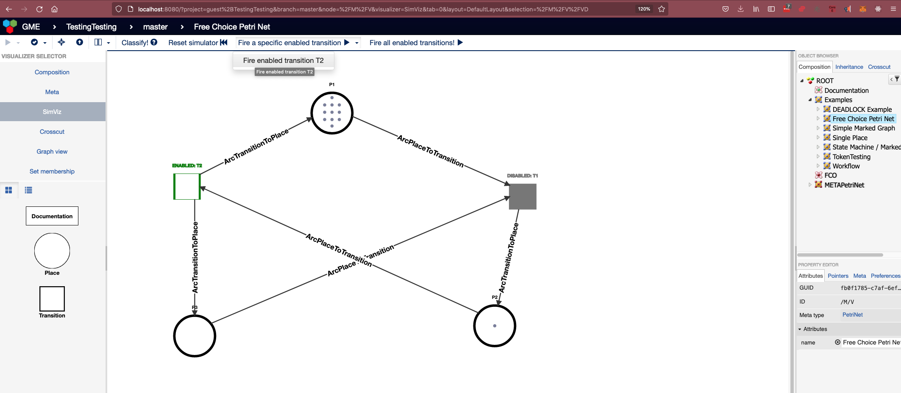

Below you will find additional documentation covering:

1. What the Petri Net domain entails (i.e. the concepts, relationships, classificiations, etc.)
2. Use cases of the Petri Net domain
3. How to install the studio and work with it on your own machine
4. How to use the design studio after installing it
5. Domain-specific features and visualizations offered by this studio

## The Petri (**P**lace/**Tr**ansition) Net Domain

A [Petri Net](https://en.wikipedia.org/wiki/Petri_net), in a nutshell, is simply a directed [bipartite](https://en.wikipedia.org/wiki/Bipartite_graph) graph for modeling concurrent behavior of distributed systems. Let's dive into that nutshell a bit.


Specifically, a Petri Net can show us how activity (represented with _tokens_ as I'll explain later) can (and cannot) flow through a system, where the system may comprise many components and pathways for that activity to potentially flow, or perhaps points of failure beyond which activity cannot flow.

### Bipartite?

If we remember that any graph `G` is just a set of vertices and a set of edges ( $G=(V,E)$ ), a **bipartite** graph is a graph in which one can divide its set of vertices $V$ into two **disjoint** sets $V_A$ and $V_B$, such that each edge $e_i \in E$ connects a vertex $a$ in $V_A$ to a vertex $b$ in $V_B$. This is described visually in the below diagram.

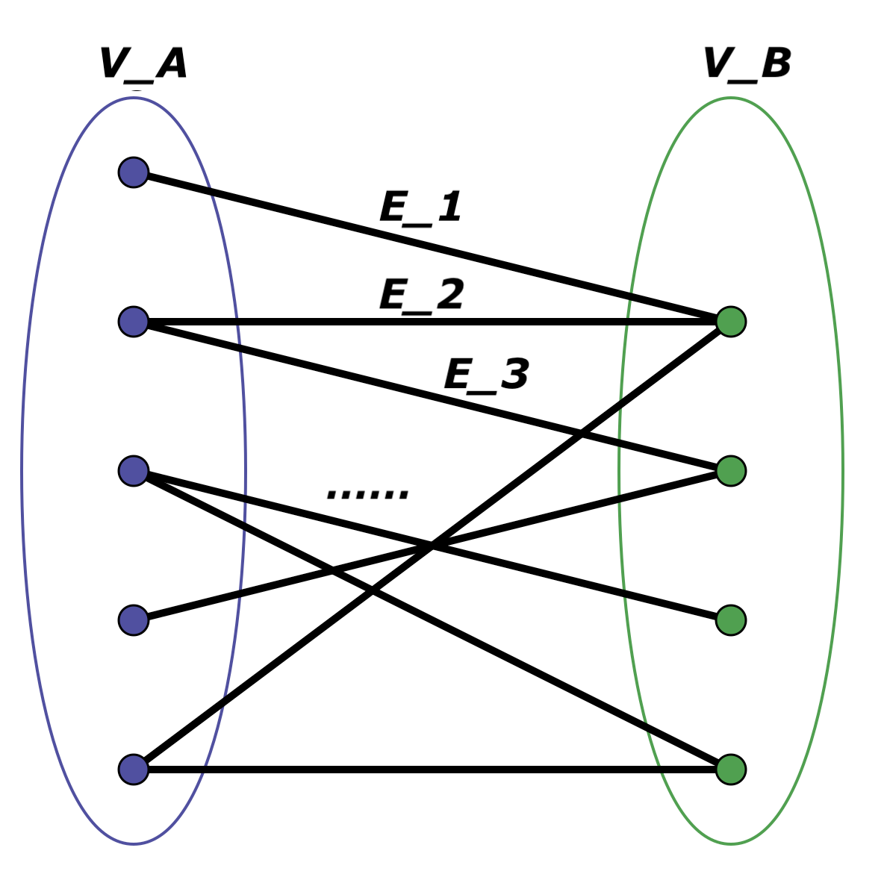

With a Petri Net graph, we have two different (**disjoint**) sets of vertices: **Places** and **Transitions**, generally represented respectively as **circles** and **squares**. Referencing the above definition and diagram, think of **Places** as $V_A$ and think of transitions as $V_B$, and the union of both of those as the full set of vertices $V$. The edges in a Petri Net are called **arcs**, and an arc can be one of **two** types: a **place to transition arc** that goes from a **Place** to a **Transition** ($V_A \implies V_B$), or a **transition to place** arc that goes from a **Transition** to a **Place** ($V_B \implies V_A$). Arcs never connect places to places, nor do they ever connect transitions to transitions. This specification is enforced via the Petri Net **metamodel**, and you'll notice that if you try to make one of these disallowed connections in your own model instance, you will not be able to.

So far, we know we are dealing with 3 main concepts: **Places**, **Transitions**, and **Arcs**, where **Arcs** have two subtypes that we will from this point forward refer to as **ArcPlaceToTransition** and **ArcTransitionToPlace**. Let's look at each of these concepts in a bit more detail.

### Concepts

Below is an outline of the key concepts within the Petri Net domain. These concepts and their relationships are mapped out in the Petri Net metamodel in this project.

#### Places

Places are represented as **circles** in a Petri Net and are key in representing the holistic state, or **marking**, of a Petri Net.

##### What's a marking?

A **marking** of a Petri Net is simply a function mapping each Place in the Petri Net to a non-negative number of tokens. In my design studio, tokens are represented as smaller circles (black by default) within the parent Place circle up to 12; if the place's token value exceeds 12, an integer is displayed. This marking tells us a lot of information about potential behavior of the network as it relates directly to transitions being fireable, which I discuss more in the Transitions section. In this design studio, every Petri Net includes in its decoration a description of its initial marking. As an example, a Petri Net with 5 places `P1, P2, P3, P4`, and `P5` with respective initial token values of `1, 2, 3, 1`, and `0`, is described in its decoration as `M: P1-1 P2-2 P3-3 P4-1 P5-0`. Generally, it follows the format:

```
M: <PlaceName>-<initial token value> ... for each place
```

You will notice that when you are creating your own Petri Net model instance, each Place that you add has an attribute in the Composition view called **currentMarking**, which is just an integer indicating how many tokens are **initially** stored in that place. (my intention as indicated in [TODO.md](TODO.md) is to update the attribute name "`currentMarking`" to "`initialTokens`" to more accurately reflect this).

I mentioned previously that "activity" is represented with tokens, which was intentionally very general. Since a Petri Net can be used to model a wide variety of real-world distributed systems, you can think of tokens as representing any quantifiable _thing_ that may move throughout the "nodes" within that system, such as a property that may be true or false for each node at any given point in time; e.g., if a Place has a token, the property is true, otherwise the property is false. Or, if a Place `Q` representing a message queue has `N` tokens, that could represent `N` queued messages to be sent to a consumer (represented by a different Place `C`) which would be a second hop after one of `Q`'s _outTransitions_, discussed below.

In addition to tokens, each place `P` has its own set of _inTransitions_ and a set of _outTransitions_; while somewhat self-explanatory, _inTransitions_ is the set of Transitions connecting to the Place via an Arc of type ArcTransitionToPlace (i.e., source is transition, destination is the Place `P`), and _outTransitions_ is the set of Transitions to which the Place `P` is connecting via an Arc of type ArcPlaceToTransition (i.e., source is the Place `P`, destination is transition). I will talk about this part more in the Transition section, but if a place `P` has `0` tokens at a given point in time, that implies each of its _outTransitions_ is no longer enabled, or "fireable".

#### Transitions

Transitions in a Petri Net are represented visually as squares. Similar to Places, each Transition `T` has its own set of _inPlaces_ and set of _outPlaces_. The _inPlaces_ is the set of all Places connecting to the Transition `T` via an Arc of type ArcPlaceToTransition (i.e. source is Place, destination is Transition `T`). The _outPlaces_ is the set of all Places to which Transition `T` is connecting via an Arc of type ArcTransitionToPlace (i.e. source is Transition `T`, destination is Place). A transition is said to be "enabled" when all of its _inPlaces_ have at least one token; an "enabled" transition is also referred to as a "fireable" transition, which is why you'll see in the design studio's `SimViz` vizualizer that you have options to "Fire" transitions that are enabled, either **specifically** or **all at once**. When you **fire** an enabled/fireable transition, that transition basically consumes one token from each of its _inPlaces_, and adds, or creates, one token on each of its _outPlaces_. If any of its _inPlaces_ have `0` tokens, the transition is disabled and does not re-enable until all of its _inPlaces_ have at least `1` token again. (Side note: in my custom simulation visualizer, enabled transitions are represented as pulsating squares, while disabled transitions are represented as static, grey-filled squares.)

Within the design studio, every time you fire either one enabled transition or all enabled transitions simultaneously, the new set of enabled transitions is recalculated based on the new marking (token values) and the visualizer updates to reflect those transition statuses.

##### Firing One Transition vs. Firing All Transitions

As mentioned above, my design studio enables both selective firing of enabled transitions and the simultaneous firing of **all** enabled transitions (if multiple are enabled). After implementation, I have begun thinking about whether **nondeterministic sequential firing** ([_interleaved semantics_](https://www.google.nl/search?q=petri%20net%20interleaving%20semantics)) should be presented as an optional alternative to simultaneous firing ([_step semantics_](https://www.google.nl/search?q=petri+net+step+semantics)). More generally, the ability to choose from a preconfigured set of [execution policies](https://en.wikipedia.org/wiki/Petri_net) for a Petri Net simulation visualizer could be useful if you know specifically the nature of your modeled system's concurrent behavior.

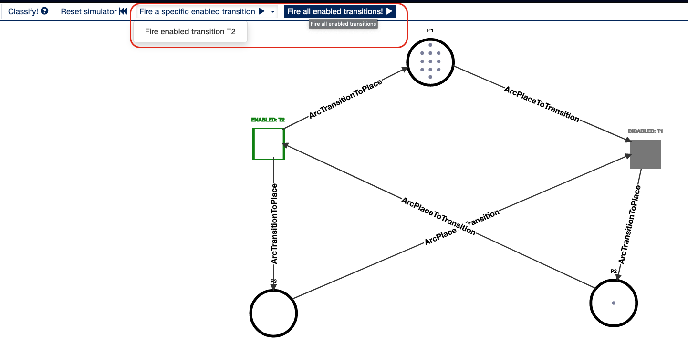

##### What if all of the transitions become disabled? DEADLOCK

If there are no transitions in the Petri Net that are enabled, i.e., *all of the Transitions have at least one *inPlace* with `0` tokens*, that Petri Net is considered **deadlocked**. Within the design studio's `SimViz` visualizer, if that happens, you can reset the Petri Net to its initial **marking**. Also, you can consider ways of adjusting token values, changing the order of transition firing, or even modifying the structure of the network itself to prevent the deadlock from occurring again. To give an example, if you have a network with two places `P1` and `P2`, where the **marking** is `P1-1 P2-0`, and you have one transition `T1` between the two such that the network looks like:

$$P1_\text{tokens=1} \implies T1 \implies P2_\text{tokens=0} $$
Then `T1` would be enabled until it's fired once, after which it becomes disabled because its only _inPlace_ `P1` loses its only token which moves instead to `P2`, an _outPlace_. If `T1` becomes disabled, the network itself becomes **deadlocked** since there are no more enabled transitions. Note that any network that matches this `Workflow` pattern (discussed in more detail later) will produce the same result.

#### Arcs

Arcs function as the edges within Petri Nets. They play a major role in much of the logic behind the visualization and the classification of Petri Nets. They don't inherently store much information aside from their source and their destination. While an Arc's source can be either a Place or a Transition and the same is true for the destination, an Arc's source and destination cannot both be of the same type. This ties back into Petri Nets being bipartite, and the Places and Transitions being disjoint sets of vertices. An Arc must always either connect a Place to a Transition or a Transition to a Place.

##### ArcTransitionToPlace

As you might guess, Arcs of this type are arcs starting at a transition and ending at a place.

##### ArcPlaceToTransition

As you might guess, Arcs of this type are arcs starting at a place and ending at a transition.

## Petri Net Classes

The following is an outline of the main classes that a Petri Net model can belong to, with descriptions of their respective criteria. These are the classes whose criteria the [PetriNetClassifier plugin](petri-net\src\plugins\PetriNetClassifier\PetriNetClassifier.js) is checking in order to return notifications that indicate the class(es) of a given petri net model.

### Free Choice Petri Nets

In order for a petri net to be considered **free choice**, each transition in the net must have its own unique set of inplaces. No two separate, distinct transitions should share an in place. If an inplace is shared by any two distinct transitions, the petri net is not free choice.

### State Machine Petri Nets

A petri net is a **state machine** if every transition has exactly one inplace and one outplace.

### Marked Graph Petri Nets

A petri net is a **marked graph** if every place has exactly one out transition and one in transition.

### Workflow Petri Net

A petri net is a **workflow net** if it has exactly one source place s where s has no in transitions, one sink place o where o has no out transitions, and every place or transition within the net is on a path from s to o.

## Use Cases of Petri Nets

Petri Nets can be used to model behavior of any dynamic distributed system in which you have some sort of quantifiable thing or property that is moving around and changing on the nodes within that system. While they definitely seem like they might be exclusive to the technical domain and used to model things like electrical signals or something else equally complex (they could be), Petri Nets can be used in non-technical domains as well. Sounds a bit general, I know, so below I've itemized a few use cases.

### Supply Chain Management :department_store:

From [Investopedia](https://www.investopedia.com/terms/s/scm.asp), supply chain management is the _management of the flow of goods and services and includes all processes that transform raw materials into final products. It involves the active streamlining of a business's supply-side activities to maximize customer value and gain a competitive advantage in the marketplace._ In other words, we're looking at a perfect use case for Petri Net modeling. The flow of goods and services in a supply chain network is in itself dynamic behavior. Factories, plants, ports, and stores are nodes (places) within a supply chain network that at any point in time can carry a variety of quantifiable things, from financial value, to material, to information, and those quantifiable things need to be in place in sufficient amounts in order for transportation of said things to commence (i.e. firing a transition). [As explored by Petr Fiala](https://www.researchgate.net/publication/223105319_Information_Sharing_in_Supply_Chains), Petri Net modeling of supply chain networks can aid in supply chain management and consequently optimizing value for customers by eliminating distributed system inefficiencies.

#### Example: Supply Chain Management Model (found in the Real World Examples Petri Net container)

https://user-images.githubusercontent.com/31296526/184283359-b46879f6-0283-439b-b595-c9c829164263.mp4

The above example (included in the main project seed) demonstrates how one might model the flow of material (regardless of what that material is) through a supply chain network using a Petri Net, and moreover the recycling of that material as it moves through manufacturing, distribution, point of sale systems to customers, to recycling centers and back to manufacturers again. With such a model you can identify choke points at which material may stop flowing and make decisions regarding transports.

With a supply chain network, we know that material must be sourced from a material source (or multiple in this example), whether foreign or domestic. The material MUST exist in order for the material to be transported to the port. Material must be at the port in order for it to then be transported to manufacturing locations, and so on through the distribution center, the individual retail stores, the customer base(s) for each of those stores and the recycling centers.

This is perhaps one of the clearest use cases of Petri Net modeling because each "Place" is for the most part a physical place, and each transition is, for the most part, a transport or a transaction.

### Biology :thinking: :microscope: :test_tube:

As discussed by [Voss et. al](https://link.springer.com/article/10.1007/s100090100058), [Oyelade et. al](https://ieeexplore.ieee.org/document/8560985), and others, Petri Nets also have application in the modeling and analysis of metabolic pathways in living organisms, which ultimately are just chains of chemical reactions that take place within a cell. At a high level, these papers explore the use of Petri Nets for the analysis and simulation of biological energy production, and the second paper specifically makes mention of using Petri Nets for identifying potential "**choke points**" of this production for the purpose of killing off a parasite called [plasmodium falciparum](https://en.wikipedia.org/wiki/Plasmodium_falciparum), the deadliest species of Plasmodium that causes malaria in humans. Tying this back into the above discussion of Petri Net concepts, we know that a **choke point** could be represented / identified as a transition that becomes disabled due to an inplace not having sufficient tokens, which could mean, in a biological system, that a given reaction in a pathway cannot take place due to a missing or insufficient amount of a given reactant. I am not a biologist but it seems that one way a Petri Net could be used in this biological context would be to represent chemical reactions as _transitions_, necessary reactants as _places_, and the presence of those reactants as the presence of _tokens_ in those respective places. Thus, a missing token means a missing reactant, and we know a missing reactant disables the _outTransition_ reaction.

The below is an image pulled from the work of [Oyelade et. al](https://ieeexplore.ieee.org/document/8560985) depicting a Petri Net model of the glycolysis pathway in the plasmodium falciparum parasite. It definitely depicts some advanced-level modeling complexity. Note that a model like this could be built and its behavior could in fact be simulated using this design studio if desired.

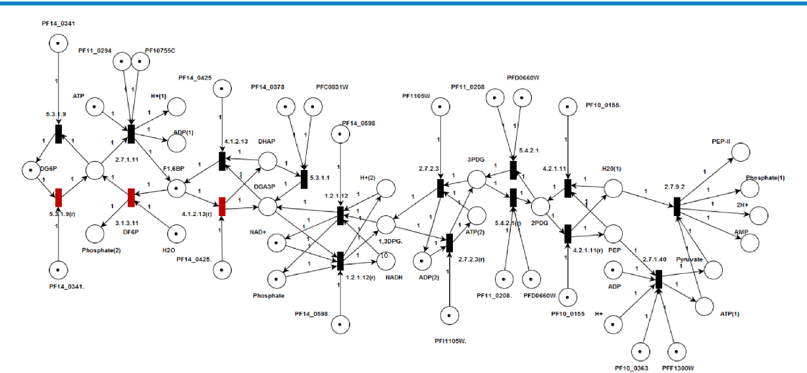

#### Example: Glycolysis & Krebs/Citric Acid Cycle Model

https://user-images.githubusercontent.com/31296526/184284012-8cebf8f0-a308-428a-b066-a78bb9c47e1e.mp4

In this example I have illustrated (quite abstractly) how a Petri Net can be used to model the Krebs or citric acid cycle, which is a series of reactions that takes in acetyl CoA and produces carbon dioxide, NADH, FADH2, and ATP or GTP. I put this together by referencing [this Khan Academy video on the Krebs cycle](https://www.khanacademy.org/science/biology/cellular-respiration-and-fermentation/pyruvate-oxidation-and-the-citric-acid-cycle/v/krebs-citric-acid-cycle).

In this case, I've used transitions to represent reactions like pyruvate oxidation of the two pyruvic acids produced by glycolysis, the merging of acetyl CoA with oxaloacetic acid, and the oxidation of citric acid. I've used places to represent molecules, in a way that allows me to represent the necessity of a molecule for the occurrence of a chemical reaction. For example, both acetyl CoA and oxaloacetic acid are necessary molecules / reactants for the beginning of the krebs / citric acid cycle because it requires their merging. The petri net allows me to model that since transitions require all inplaces of a given transition (reaction) to have at least one token (i.e. be present and ready to react) in order to fire (react/take place).

Note that I did give an initial token value of 1 to both oxaloacetic acids, otherwise the petri net reaches a deadlock after the firing of both pyruvateOxidation reactions. This feels like a "chicken or the egg" problem; if the krebs cycle is indeed a cycle and it requires what it produces in order to start over, then shouldn't that required reactant be present at the beginning prior to the cycle taking place? That's the assumption I am working with! Fun stuff.

Also note that I arbitrarily initialized 5 glucose molecules which allows for 5 executions of the full krebs cycle before reaching a deadlock, because the acetyl CoA that comes from the glucose source is, again, one of the two requirements for the beginning of the krebs cycle.

## Installation

Below I will provide instructions for installing this design studio in your local development environment. Note that I used **macOS Catalina 10.15.7** with **NodeJS v18.0.0** to develop the design studio, and **NodeJS v14** to export the project seed (since **v18.0.0 did not allow project exporting due to HTTP response related errors**).

1. Clone the repository.

```
git clone https://github.com/austinjhunt/petrinet-webgme-designstudio
```

2. Navigate into the root project directory, e.g. `cd petrinet-webgme-designstudio`
3. Install [NVM](https://github.com/nvm-sh/nvm), **a convenient version manager for NodeJS**, if you don't already have it installed.

### MacOS (tested on MacOS Catalina 10.15.7)

4. Using NVM, install and activate Node JS v18.0.0
   1. `nvm install 18 && nvm use 18`
5. Update NPM to latest version 8.15.1 (might not be necessary to run this project but it's generally good to stay up to date)
   1. `npm install -g npm@8.15.1`
6. Install [MongoDB](https://www.mongodb.com/).
   1. **This project will not work with new versions of Mongo - at least, it didn't on MacOS Catalina**. You need a version **before 5.0** which deprecated the use of `OP_QUERY command: find.`
   2. To install MongoDB easily on MacOS, you should install the [Homebrew package manager.](https://brew.sh/). Then you can install MongoDB Community 4.4 using homebrew on MacOS with `brew install mongodb-community@4.4`
7. Install `webgme-cli` as a global npm module: `npm install -g webgme-cli`
8. Navigate into the `petri-net` directory and install all of the necessary packages with `npm install` or shortened, `npm i`
9. Within the `petri-net` directory, start the project with `webgme start`. If that does not work you can also try starting the project with `npm start` from within that directory.
10. Skip ahead now to the OS-agnostic instructions

### Windows (instructions tested on Windows 11 machine)

4. Using NVM, install and activate Node JS v16.13.2. (Later versions of NodeJS cause [this issue](https://github.com/npm/cli/issues/4234) on Windows)
   1. `nvm install 16.13.2 && nvm use 16.13.2`
5. Update NPM to latest version 8.15.1 (might not be necessary to run this project but it's generally good to stay up to date)
   1. `npm install -g npm@8.15.1`
6. Install [MongoDB](https://www.mongodb.com/)

   1. **This project will not work with new versions of Mongo - at least, it didn't on MacOS Catalina**. You need a version **before 5.0** which deprecated the use of `OP_QUERY command: find.`
   2. Here is a MongoDB 4.4.16 release download link that you can use to download and install MongoDB 4.4: [https://fastdl.mongodb.org/windows/mongodb-windows-x86_64-4.4.16-rc0-signed.msi](https://fastdl.mongodb.org/windows/mongodb-windows-x86_64-4.4.16-rc0-signed.msi)
   3. Install and run MongoDB as a service using that `.msi` file once you download it.
      1. 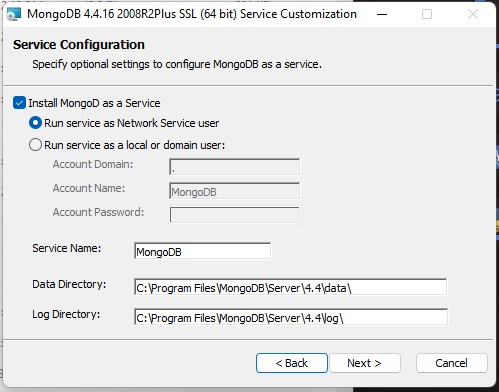

7. Install `webgme-cli` as a global npm module: `npm install -g webgme-cli`
8. Navigate into the `petri-net` directory and install all of the necessary packages with `npm install` or shortened, `npm i`
9. Within the `petri-net` directory, start the project with `npm start`. You may try `webgme start` as well but that webgme CLI command failed for me on Windows 11. Allow access if this triggers a popup.
10. Skip ahead now to the OS-agnostic instructions

### OS-agnostic instructions now that your server is running :sunglasses: :nerd_face:

10. Navigate to [`http://localhost:8080`](http://localhost:8080)
11. Create a new project by typing your desired project name in the Project Name input field.
    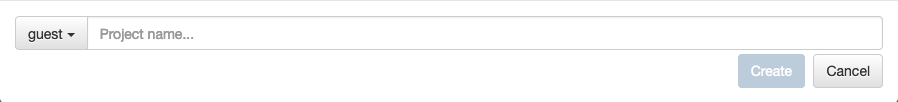
12. Choose `PetriNetSeed` as the seed in the `Choose an existing seed` dropdown. Click create.
    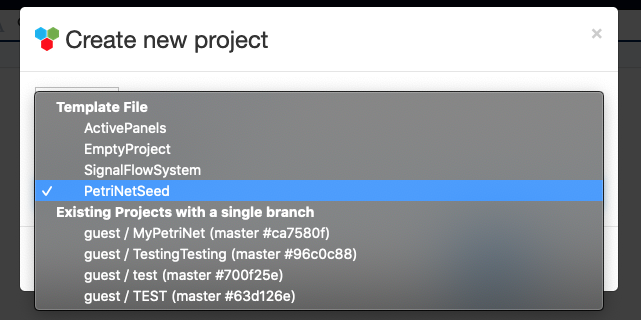
13. You should now see a screen that looks like this. If you are working on a smaller screen you may not see the full view; you can either zoom out or scroll horizontally to see all components in the view. This is the Composition visualization of the ROOT component.
    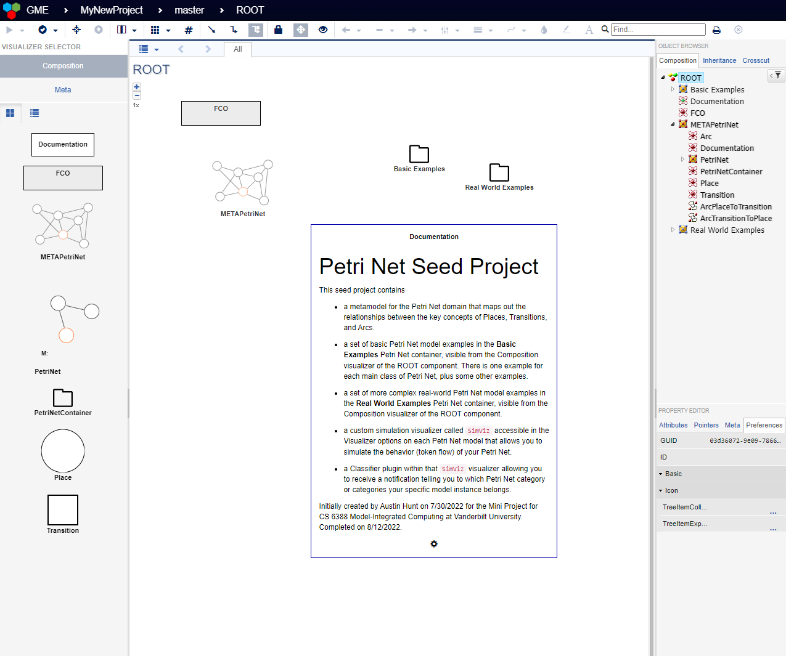
    The ROOT component basically wraps up everything including the PetriNet metamodel and the specific example model instances that are contained in the `Basic Examples` and `Real Word Examples` PetriNetContainers.

## Start Modeling

You've now created your own project within the design studio! So **how do you create a model?**

1. First things first, think of something you want to model. I'm going to create a model of a game of Ping Pong as a fun little example to demonstrate creating a model.
2. Let's make sure we're in the right visualizer. Double click the `ROOT` on the Composition object browser on the right. This sets the context to the root object.
   1. 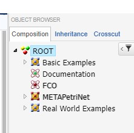
3. Then click the `Composition` visualizer option on the left to make sure you're in the `Composition visualizer`.
   1. 
4. Click and drag a `PetriNetContainer` into your main composition view.
   1. 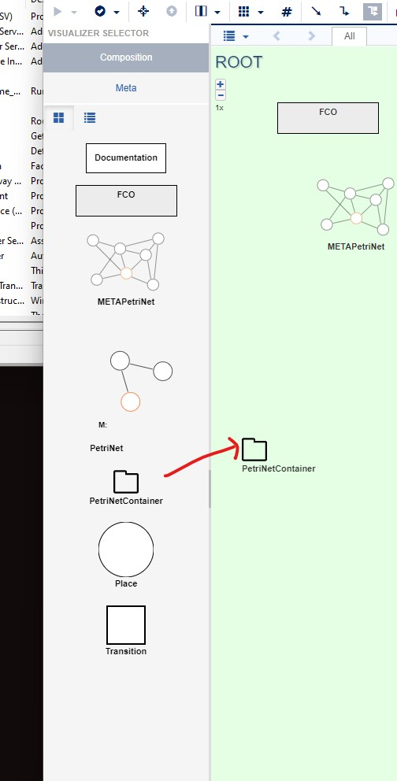
5. Double click the title of the PetriNetContainer you just added and change it to something like `MyExamples`:
   1. 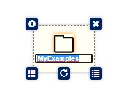
6. Now double click the icon for the container to open it up. We're now in the Composition visualizer of the `MyExamples` container.
   1. 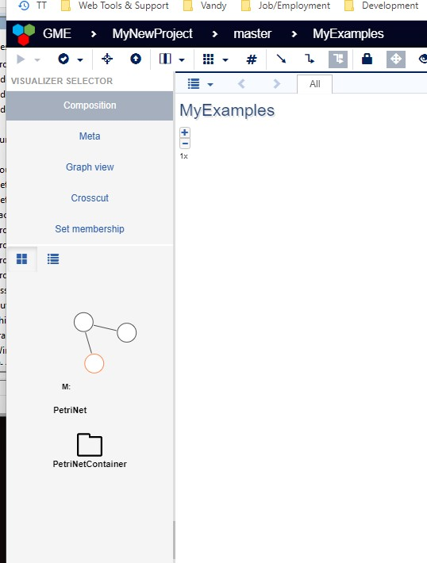
7. Within this container, let's create our first petri net model instance. Drag in a PetriNet into your composition visualizer from the component selector on the left, similar to how you created the container.
8. Give it a name indicative of what you're modeling. I'm going to call mine 'PingPong'.
   1. 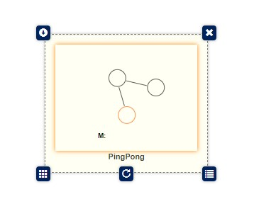
9. Double click the icon for the Petri Net.
10. Here's where we get to start thinking. For a ping pong game, I'm going to represent two players, A and B, as places. I'm going to represent player A hitting the ball to player B as one transition, and player B hitting the ball to player A as another transition. To do this:
    1. I drag in two Places (circles) and two Transitions (squares) from the left.
    2. I double click their titles to rename them respectively as PlayerA, PlayerB, AtoB, and BtoA.
    3. I then connect them in a way that represents the cyclical path the ball can take. I'm going to abstractly build this model with the assumption that the ball is always in play for demonstration sake. When I make a connections (an arc), I click on the arc (line) and open the Attributes property editor on the bottom right so I can rename it. Double clicking the title on an arc does not let you rename it like the other components.
       1. 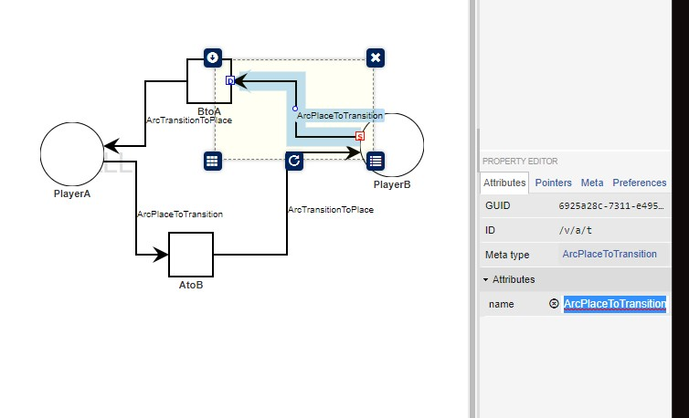
    4. Since in a ping pong game each player hits the ball, then it bounces before reaching the next player, I can name the arcs before and after each transition as respectively `hit` and `bounce`. Also, I know there is only one ball in the game, and I can represent that ball as one token that simply moves between each of the players at each "round" or "fire". So, I can click on PlayerA, open its attribute editor on the right, and set its token value attribute (`currentMarking`) to 1 to indicate that Player A is initially serving the ball.
       1. 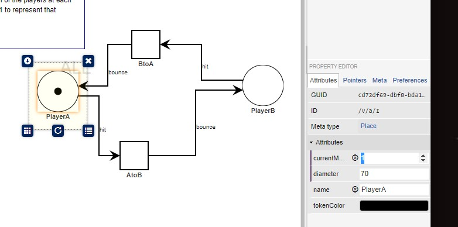
11. Now that I've build the structure of the game, I can simulate it. I'll discuss simulation in detail in the next section. Note that right now all we've defined really is the initial structure of our model: the concepts involved, their relationships, and an initial "marking" (i.e. PlayerA-1 PlayerB-0) that indicates who's serving when a new game starts.
12. One last thing: by default all Petri Net models (according to a requirement enforced by my metamodel) contain at least one piece of editable documentation in the Composition visualizer to encourage you to provide a description of your model and what it represents. Here is my documentation after editing it for the Ping Pong model:
    1. 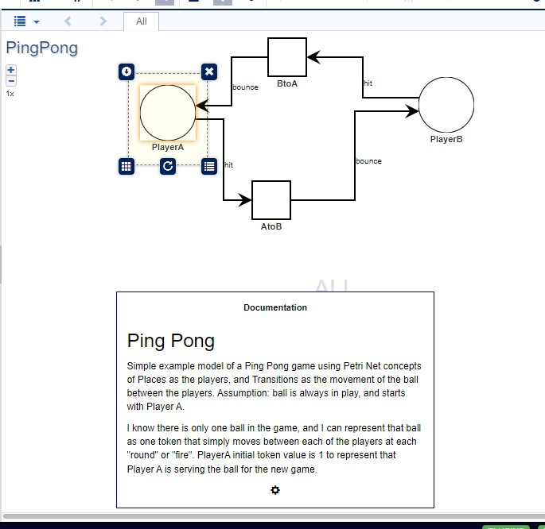

## Using the Custom Simulation Visualizer and Classification Plugin

1. To simulate the model that you are building, double click your model in the Object browser on the right and then click on the `SimViz` visualizer in the visualizer option list on the left. Below is an example of what you should see using my `PingPong` model.
   1. 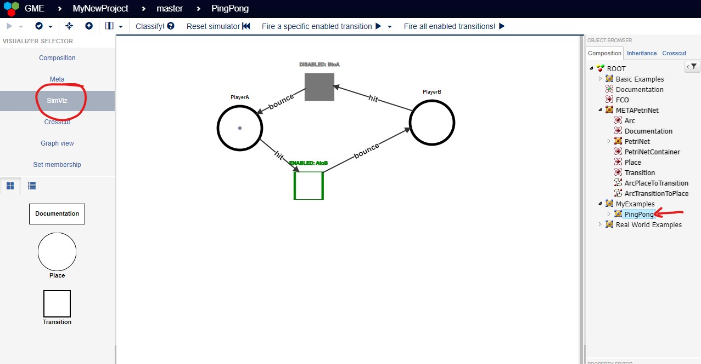
2. Notice that the enabled transition (the one whose _inplace_ has the token) is green and pulsating (and labeled with `ENABLED:`) and the disabled transition is grey and static (and labeled with `DISABLED:`).
3. In the top toolbar, as shown in the above screenshot, you should see a `Classify!` button with a question mark icon. If you click this, you will receive one or more notifications in the bottom right notifications widget. Each notification will indicate a class of Petri Net that your model belongs to based on the criteria outlined in the above **Petri Net Classes** section.
   1. 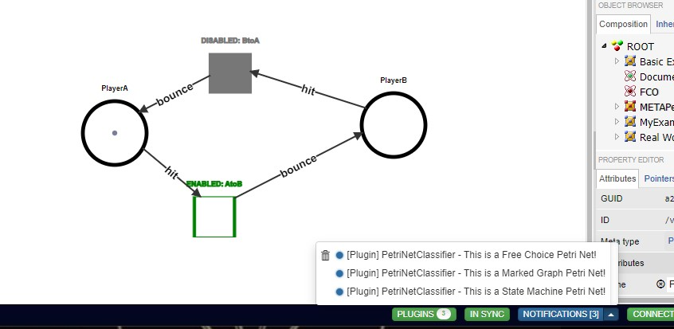
   2. In my example, I receive three notifications; my model is:
      1. A free choice net since both transitions have their own unique in place
      2. A marked graph since both places have exactly one in transition and one out transition, and
      3. A state machine since both transitions have exactly one inplace and one outplace.
4. You should also see a `Reset Simulator` button with a reset icon. Clicking this resets the visualization back to the initial marking (i.e. the initial number of tokens at each place as indicated in the attribute editor of the composition view) and redecorates the enabled/disabled statuses of the transitions based on that initial marking.
5. If there are transitions that are enabled, you should see two additional buttons:
   1. `Fire a specific enabled transition`. Clicking this opens a dropdown menu with a list of the transitions currently enabled (with all in places having at least one token). You can click any of these transitions to fire them specifically, i.e. decrement their in places by one token and increment their out places by one token.
   2. `Fire all enabled transitions`. Clicking this will actually fire all of the transitions that are currently enabled simultaneously. There is a logical error in this simultaneous firing option outlined in [DEV.md](DEV.md) which is why I plan to either remove it as a button or replace it with interleaved random firing of all enabled transitions. That is, if 3 transitions are enabled and you fire them all, they fire sequentially in a random order rather than all at once which produces inconsistencies in token values.
6. If there are no transitions enabled/fireable, you are not provided the option of firing any transitions (single or all). Instead, you should see a `DEADLOCK` label in place of the buttons. Also, any time your model reaches a deadlock state where all transitions are disabled, you should receive a notification in the bottom right notifications widget indicating that it has reached a deadlock state. An example is given below, produced by setting the token value to 0 for both players in the ping pong game. You can't play ping pong with no ball. Sad day.
   1. 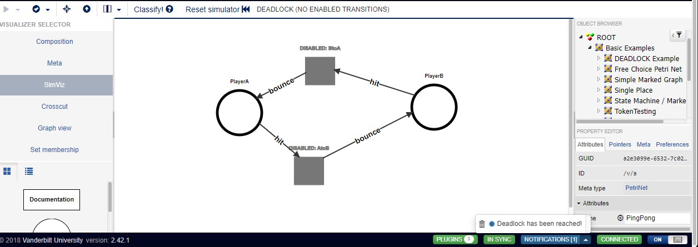
