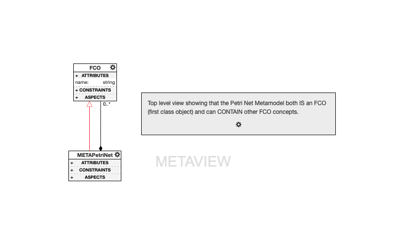
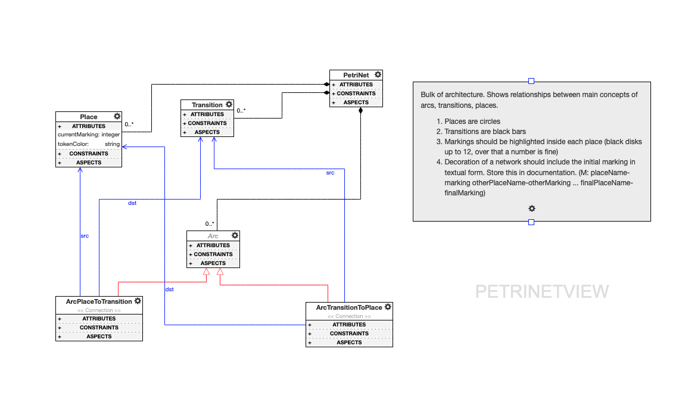
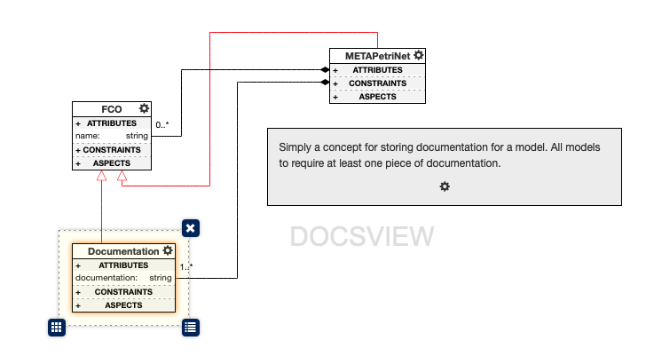
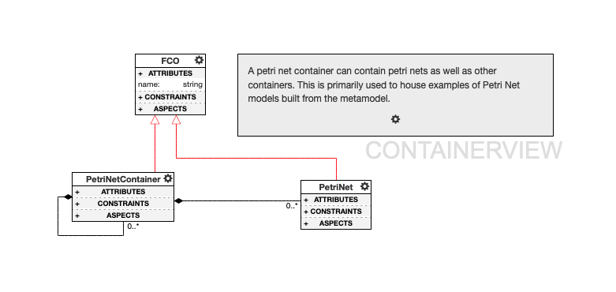
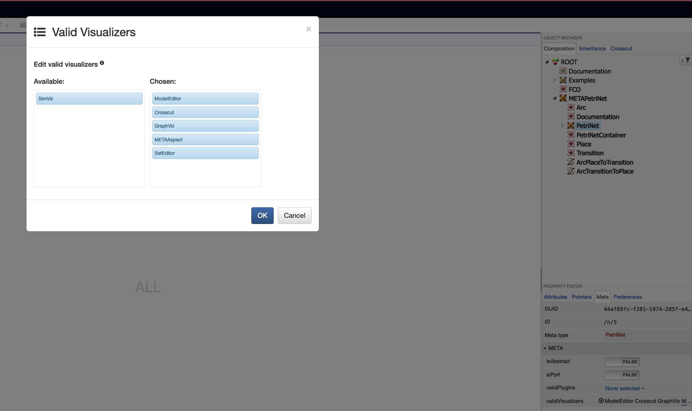

# Petri Net Design Studio

This is a project focused on creating a design studio with special attention to the concept of a [Petri Net](https://en.wikipedia.org/wiki/Petri_net), one of several mathematical modeling languages for describing distributed systems. In this project, I use [NodeJS](https://nodejs.org/en/) and [WebGME](https://webgme.readthedocs.io/) heavily to create a custom design studio that not only allows for modeling Petri Net structure (i.e. relations between transitions, places, and arcs), but also for modeling Petri Net behavior via custom simulation visualizers built with [JointJS.](https://www.jointjs.com/)

## Seed Project - The Petri Net Metamodel

I first created a project seed from the public WebGME instance we've been using at [https://mic.isis.vanderbilt.edu/](https://mic.isis.vanderbilt.edu/).
Project seed included foundational architecture of the Petri Net Meta Model. Below are some screenshots of the various views created within the seed project.
After creating the seed, I exported it via the `master > Export branch` feature in the top nav, stored it within this project such that it could be read in as a seed.

### METAView

Top level view showing that the Petri Net Metamodel both IS an FCO (first class object) and can CONTAIN other FCO concepts.



### PetriNetView

The bulk of the architecture for the metamodel; highlights relationships between transitions, arcs, and places.



### DocsView

A view focused on the (simple) `Documentation` concept for storing documentation about a model.



### ContainerView

A view focused on the `PetriNetContainer` concept. A petri net container can contain petri nets as well as other petri net containers. Primarily used to house examples of Petri Net models built from the metamodel.



## Creating the Seed

To create the seed such that it would show up in the seed choices when creating a new project at `http://localhost:8888`, I took the following steps:

1. I created the folder `seeds` within the `src` folder and placed the exported webgmex file in that folder with the name `PetriNetProjectSeed.webgmex`
2. In order to include that new folder in the "seed search", if you will, I added

```
config.seedProjects.basePaths.push('src/seeds')
```

to the [config.webgme.js](petri-net/config/config.webgme.js) file.

3. I restarted the server.
4. I then made sure it worked by creating a new project and choosing the `PetriNetProjectSeed` option from the seed choices.

## Development Environment Setup

The below are the steps taken to set up a local WebGME development environment on my late 2012 iMac.

1. Install, activate Node JS v 18.0.0
   1. `nvm install 18 && nvm use 18`
2. Update NPM to latest version 8.15.1
   1. `npm install -g npm@8.15.1`
3. Install [MongoDB](https://www.mongodb.com/)

- This project will not work with new versions of Mongo. You need a version before 5.0 which deprecated the use of OP_QUERY command: find. Example: `brew install mongodb-community@4.4` Otherwise you will get error:

```
{
  metadata: {
    name: 'MongoError',
    message: 'Unsupported OP_QUERY command: find. The client driver may require an upgrade. For more details see https://dochub.mongodb.org/core/legacy-opcode-removal',
    ok: 0,
    errmsg: 'Unsupported OP_QUERY command: find. The client driver may require an upgrade. For more details see https://dochub.mongodb.org/core/legacy-opcode-removal',
    code: 352,
    codeName: 'UnsupportedOpQueryCommand'
  }
}
```

4. Install `webgme-cli` as a global npm module
   1. `npm install -g webgme-cli`
5. Created project with:
   1. `webgme init petri-net` which outputs:

```
Start your WebGME app with 'webgme start' from the project root.
It is recommended to run 'npm init' from the within project to finish configuration.
```

5. Ran `npm init` from within the new `petri-net` folder as indicated above. Used mostly default values, except for GitHub repository, keywords, and author.
6. Started project with `webgme start` from within `petri-net` folder.

### Decoration

I didn't create my own custom decorator, and instead just used the SVG Decoration following [this tutorial on YouTube on Dynamic SVG Rendering in WebGME with EJS](https://www.youtube.com/watch?time_continue=1&v=l5m4CF4w8fE&feature=emb_logo).

Below is an outline of the specific decorations that were implemented to achieve the requirements.

- [Places](petri-net/src/decorators/PetriNetDecorator/Icons/Place.svg) are circles containing <MARKING> tokens. SVG Decorator used with [EJS](https://ejs.co) to dynamically render up to 12 "token" discs (where the number of discs is the marking for the place) inside of a Place circle. When the marking of a place exceeds 12, it just prints a number inside the place circle. Token disc color can be customized with the `tokenColor` attribute of each place. Default is black.
- [Transitions](petri-net/src/decorators/PetriNetDecorator/Icons/Transition.svg) are squares, created with SVG decorator. No EJS necessary since nothing needs to be dynamically rendered.
- [Petri Nets](petri-net/src/decorators/PetriNetDecorator/Icons/PetriNet.svg) are decorated with a network icon supplemented with a textual description of the initial marking formatted as follows:

```
M: placeName-marking otherPlaceName-otherMarking ... finalPlaceName-finalMarking
```

This initial marking description took a bit of logic to build out using [EJS](https://ejs.co) as part of the SVG Decorator. The marking description on the backend uses in matrices and out matrices to first try to build an ordered string of the places if the petri net has a "start" Place (out flow only with no in flow); if there is no start place meeting that criteria, it starts from a random place. The string builder uses [breadth-first traversal](https://www.geeksforgeeks.org/breadth-first-search-or-bfs-for-a-graph/) of the network and avoids infinite loops by skipping already-traversed places.

### Simulation

Next step: simulating behavior! Requirements of the simulator:

- Should visualize the network similarly to the composition
- Additionally, it should differentiate the transitions that are enabled
- Firing should happen once the user clicks on an enabled transition
- Markings should progress according to firings (no animation is required, but would be nice)
- The visualizer should have a ‘reset’ button on its toolbar that switches the network back to the initial marking
- The state of the simulation should not be reflected in the model
- If your network reaches a deadlock (there is no enabled transition), some visual effect should notify the user (or an actual notification...)

To do this, as documented [here](https://github.com/webgme/webgme/wiki/GME-Visualizers), I decided to use the `webgme new viz` command using the webgme CLI tool. When checking options with the `--help` flag, I got this response:

```
(base) huntaj-imac:petrinet-designstudio huntaj$ webgme new viz --help

  Usage: webgme-new-viz [options] <visualizerID>

  Options:

    -h, --help               output usage information
    --name <visualizerName>  Set the visualizer name. Default is the id
    --secondary              Create visualizer not used for active node visualization
```

So, I need to create a primary visualizer for Simulation, but it looks like I'll need secondary visualizers for the additional UI pieces like the 'reset' button.

To create a primary visualizer with the name `Simulator` and an ID of `SimViz`:

```
webgme new viz --name Simulator SimViz
```

I also had to manually update the WebGME Config file [config.webgme.js](petri-net/config/config.webgme.js) to include this line, otherwise the visualizer is completely ignored:

```

// visualizer descriptors
config.visualization.visualizerDescriptors.push(
  `${__dirname}/../src/visualizers/Visualizers.json`
);
```

I then restarted the server with `CTRL+C` and `webgme start`. To verify the addition of the new visualizer, I went to the `PetriNet` meta type, opened the `Meta` tab, selected the `...` icon under `validVisualizers`, and checked for `SimViz` in the `Available` column:



I added the `SimViz` visualizer directly underneath the `ModelEditor` visualizer in the Chosen column so it can appear as the second visualizer for all Petri Net model instances.
