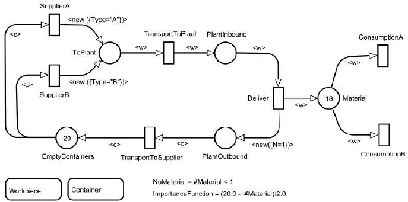

# Petri Net Design Studio

This is a project focused on creating a design studio with special attention to the domain of [Petri Nets](https://en.wikipedia.org/wiki/Petri_net), one of several mathematical modeling languages for describing (modeling) distributed systems. In this project, I use [NodeJS](https://nodejs.org/en/), [JointJS](https://resources.jointjs.com), and [WebGME](https://webgme.readthedocs.io/) to create a custom design studio that not only allows for modeling Petri Net structure (i.e. relationships between the concepts of transitions, places, and arcs), but also for modeling Petri Net behavior via a custom simulation visualizer built with [JointJS.](https://www.jointjs.com/), as well as for classifying instances of Petri Net models as `Marked Graphs`, `Workflows`, `State Machines`, and `Free Choice nets` which each have signature characteristics.

## Screenshot of Design Studio Simulation Visualizer:


Below you will find additional documentation covering:

1. What the Petri Net domain entails (i.e. the concepts, relationships, classificiations, etc.)
2. Use cases of the Petri Net domain
3. How to install the studio and work with it on your own machine
4. How to use the design studio after installing it
5. Domain-specific features and visualizations offered by this studio

## The Petri (**P**lace/**Tr**ansition) Net Domain

A [Petri Net](https://en.wikipedia.org/wiki/Petri_net), in a nutshell, is simply a directed [bipartite](https://en.wikipedia.org/wiki/Bipartite_graph) graph for modeling concurrent behavior of distributed systems. Let's dive into that nutshell a bit.


Specifically, a Petri Net can show us how activity (represented with _tokens_ as I'll explain later) can (and cannot) flow through a system, where the system may comprise many components and pathways for that activity to potentially flow, or perhaps points of failure beyond which activity cannot flow.

### Bipartite?

If we remember that any graph `G` is just a set of vertices and a set of edges ( $G=(V,E)$ ), a **bipartite** graph is a graph in which one can divide its set of vertices $V$ into two **disjoint** sets $V_A$ and $V_B$, such that each edge $e_i \in E$ connects a vertex $a$ in $V_A$ to a vertex $b$ in $V_B$. This is described visually in the below diagram.


With a Petri Net graph, we have two different (**disjoint**) sets of vertices: **Places** and **Transitions**, generally represented respectively as **circles** and **squares**. Referencing the above definition and diagram, think of **Places** as $V_A$ and think of transitions as $V_B$, and the union of both of those as the full set of vertices $V$. The edges in a Petri Net are called **arcs**, and an arc can be one of **two** types: a **place to transition arc** that goes from a **Place** to a **Transition** ($V_A \implies V_B$), or a **transition to place** arc that goes from a **Transition** to a **Place** ($V_B \implies V_A$). Arcs never connect places to places, nor do they ever connect transitions to transitions. This specification is enforced via the Petri Net **metamodel**, and you'll notice that if you try to make one of these disallowed connections in your own model instance, you will not be able to.

So far, we know we are dealing with 3 main concepts: **Places**, **Transitions**, and **Arcs**, where **Arcs** have two subtypes that we will from this point forward refer to as **ArcPlaceToTransition** and **ArcTransitionToPlace**. Let's look at each of these concepts in a bit more detail.

### Concepts

Below is an outline of the key concepts within the Petri Net domain. These concepts and their relationships are mapped out in the Petri Net metamodel in this project.

#### Places

Places are represented as **circles** in a Petri Net and are key in representing the holistic state, or **marking**, of a Petri Net.

##### What's a marking?

A **marking** of a Petri Net is simply a function mapping each Place in the Petri Net to a non-negative number of tokens. In my design studio, tokens are represented as smaller circles (black by default) within the parent Place circle up to 12; if the place's token value exceeds 12, an integer is displayed. This marking tells us a lot of information about potential behavior of the network as it relates directly to transitions being fireable, which I discuss more in the Transitions section. In this design studio, every Petri Net includes in its decoration a description of its initial marking. As an example, a Petri Net with 5 places `P1, P2, P3, P4`, and `P5` with respective initial token values of `1, 2, 3, 1`, and `0`, is described in its decoration as `M: P1-1 P2-2 P3-3 P4-1 P5-0`. Generally, it follows the format:

```
M: <PlaceName>-<initial token value> ... for each place
```

You will notice that when you are creating your own Petri Net model instance, each Place that you add has an attribute in the Composition view called **currentMarking**, which is just an integer indicating how many tokens are **initially** stored in that place. (my intention is to update the attribute name "`currentMarking`" to "`initialMarking`" to more accurately reflect this).

In the beginning of this README, I mentioned that "activity" is represented with tokens, which was intentionally very general. Since a Petri Net can be used to model a wide variety of real-world distributed systems, you can think of tokens as representing any quantifiable _thing_ that may move throughout the "nodes" within that system, such as a property that may be true or false for each node at any given point in time; e.g., if a Place has a token, the property is true, otherwise the property is false. Or, if a Place `Q` representing a message queue has `N` tokens, that could represent `N` queued messages to be sent to a consumer (represented by a different Place `C`) which would be a second hop after one of `Q`'s _outTransitions_, discussed below.

In addition to tokens, each place `P` has its own set of _inTransitions_ and a set of _outTransitions_; while somewhat self-explanatory, _inTransitions_ is the set of Transitions connecting to the Place via an Arc of type ArcTransitionToPlace (i.e., source is transition, destination is the Place `P`), and _outTransitions_ is the set of Transitions to which the Place `P` is connecting via an Arc of type ArcPlaceToTransition (i.e., source is the Place `P`, destination is transition). I will talk about this part more in the Transition section, but if a place `P` has `0` tokens at a given point in time, that implies each of its _outTransitions_ is no longer enabled, or "fireable".

#### Transitions

Transitions in a Petri Net are represented visually as squares. Similar to Places, each Transition `T` has its own set of _inPlaces_ and set of _outPlaces_. The _inPlaces_ is the set of all Places connecting to the Transition `T` via an Arc of type ArcPlaceToTransition (i.e. source is Place, destination is Transition `T`). The _outPlaces_ is the set of all Places to which Transition `T` is connecting via an Arc of type ArcTransitionToPlace (i.e. source is Transition `T`, destination is Place). A transition is said to be "enabled" when all of its _inPlaces_ have at least one token; an "enabled" transition is also referred to as a "fireable" transition, which is why you'll see in the design studio's `SimViz` vizualizer that you have options to "Fire" transitions that are enabled, either **specifically** or **all at once**. When you **fire** an enabled/fireable transition, that transition basically consumes one token from each of its _inPlaces_, and adds, or creates, one token on each of its _outPlaces_. If any of its _inPlaces_ have `0` tokens, the transition is disabled and does not re-enable until all of its _inPlaces_ have at least `1` token again. (Side note: in my custom simulation visualizer, enabled transitions are represented as pulsating squares, while disabled transitions are represented as static, grey-filled squares.)

Within the design studio, every time you fire either one enabled transition or all enabled transitions simultaneously, the new set of enabled transitions is recalculated based on the new marking (token values) and the visualizer updates to reflect those transition statuses.

##### Firing One Transition vs. Firing All Transitions

As mentioned above, my design studio enables both selective firing of enabled transitions and the simultaneous firing of **all** enabled transitions (if multiple are enabled). After implementation, I have begun thinking about whether **nondeterministic sequential firing** ([_interleaved semantics_](https://www.google.nl/search?q=petri%20net%20interleaving%20semantics)) should be presented as an optional alternative to simultaneous firing ([_step semantics_](https://www.google.nl/search?q=petri+net+step+semantics)). More generally, the ability to choose from a preconfigured set of [execution policies](https://en.wikipedia.org/wiki/Petri_net) for a Petri Net simulation visualizer could be useful if you know specifically the nature of your modeled system's concurrent behavior.


##### What if all of the transitions become disabled? DEADLOCK

If there are no transitions in the Petri Net that are enabled, i.e., *all of the Transitions have at least one *inPlace* with `0` tokens*, that Petri Net is considered **deadlocked**. Within the design studio's `SimViz` visualizer, if that happens, you can reset the Petri Net to its initial **marking**. Also, you can consider ways of adjusting token values, changing the order of transition firing, or even modifying the structure of the network itself to prevent the deadlock from occurring again. To give an example, if you have a network with two places `P1` and `P2`, where the **marking** is `P1-1 P2-0`, and you have one transition `T1` between the two such that the network looks like:

$$P1_\text{tokens=1} \implies T1 \implies P2_\text{tokens=0} $$
Then `T1` would be enabled until it's fired once, after which it becomes disabled because its only _inPlace_ `P1` loses its only token which moves instead to `P2`, an _outPlace_. If `T1` becomes disabled, the network itself becomes **deadlocked** since there are no more enabled transitions. Note that any network that matches this `Workflow` pattern (discussed in more detail later) will produce the same result.

#### Arcs

Arcs function as the edges within Petri Nets. They play a major role in much of the logic behind the visualization and the classification of Petri Nets. They don't inherently store much information aside from their source and their destination. While an Arc's source can be either a Place or a Transition and the same is true for the destination, an Arc's source and destination cannot both be of the same type. This ties back into Petri Nets being bipartite, and the Places and Transitions being disjoint sets of vertices. An Arc must always either connect a Place to a Transition or a Transition to a Place.

##### ArcTransitionToPlace

As you might guess, Arcs of this type are arcs starting at a transition and ending at a place.

##### ArcPlaceToTransition

As you might guess, Arcs of this type are arcs starting at a place and ending at a transition.

## Use Cases of Petri Nets

Petri Nets can be used to model behavior of any dynamic distributed system in which you have some sort of quantifiable thing or property that is moving around and changing on the nodes within that system. While they definitely seem like they might be exclusive to the technical domain and used to model things like electrical signals or something else equally complex (they could be), Petri Nets can be used in non-technical domains as well. Sounds a bit general, I know, so below I've itemized a few use cases.

### Supply Chain Management :department_store:

From [Investopedia](https://www.investopedia.com/terms/s/scm.asp), supply chain management is the _management of the flow of goods and services and includes all processes that transform raw materials into final products. It involves the active streamlining of a business's supply-side activities to maximize customer value and gain a competitive advantage in the marketplace._ In other words, we're looking at a perfect use case for Petri Net modeling. The flow of goods and services in a supply chain network is in itself dynamic behavior. Factories, plants, ports, and stores are nodes (places) within a supply chain network that at any point in time can carry a variety of quantifiable things, from financial value, to material, to information, and those quantifiable things need to be in place in sufficient amounts in order for transportation of said things to commence (i.e. firing a transition). [As explored by Petr Fiala](https://www.researchgate.net/publication/223105319_Information_Sharing_in_Supply_Chains), Petri Net modeling of supply chain networks can aid in supply chain management and consequently optimizing value for customers by eliminating distributed system inefficiencies.



### Biology :thinking: :microscope: :test_tube:

As discussed by [Voss et. al](https://link.springer.com/article/10.1007/s100090100058), [Oyelade et. al](https://ieeexplore.ieee.org/document/8560985), and others, Petri Nets also have application in the modeling and analysis of metabolic pathways in living organisms, which ultimately are just chains of chemical reactions that take place within a cell. At a high level, these papers explore the use of Petri Nets for the analysis and simulation of biological energy production, and the second paper specifically makes mention of using Petri Nets for identifying potential "**choke points**" of this production for the purpose of killing off a parasite called [plasmodium falciparum](https://en.wikipedia.org/wiki/Plasmodium_falciparum), the deadliest species of Plasmodium that causes malaria in humans. Tying this back into the above discussion of Petri Net concepts, we know that a **choke point** could be represented / identified as a transition that becomes disabled due to an inplace not having sufficient tokens, which could mean, in a biological system, that a given reaction in a pathway cannot take place due to a missing or insufficient amount of a given reactant. I am not a biologist but it seems that one way a Petri Net could be used in this biological context would be to represent chemical reactions as _transitions_, necessary reactants as _places_, and the presence of those reactants as the presence of _tokens_ in those respective places. Thus, a missing token means a missing reactant, and we know a missing reactant disables the _outTransition_ reaction.

The below is an image pulled from the work of [Oyelade et. al](https://ieeexplore.ieee.org/document/8560985) depicting a Petri Net model of the glycolysis pathway in the plasmodium falciparum parasite. It definitely depicts some advanced-level modeling complexity. Note that a model like this could be built and its behavior could in fact be simulated using this design studio if desired.


You finally have to create documentation to your design studio. It can be as simple as a readme.md file in the repository, but it has to clarify the following things for the user:
● What is the domain about
● A few sentence on the typical use-cases of the domain
● How to install the design studio
● How to start modeling once the studio is installed
● Once a network is build, what feature your studio provides and how can the user use
those functions
