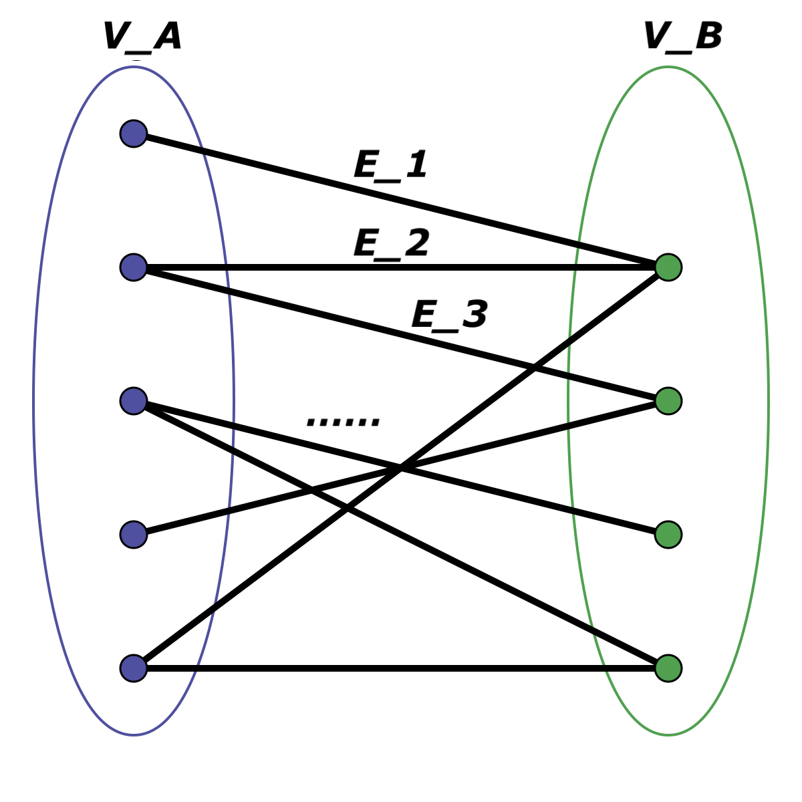

You finally have to create documentation to your design studio. It can be as simple as a readme.md file in the repository, but it has to clarify the following things for the user:
● What is the domain about
● A few sentence on the typical use-cases of the domain
● How to install the design studio
● How to start modeling once the studio is installed
● Once a network is build, what feature your studio provides and how can the user use
those functions

# Petri Net Design Studio

This is a project focused on creating a design studio with special attention to the domain of [Petri Nets](https://en.wikipedia.org/wiki/Petri_net), one of several mathematical modeling languages for describing (modeling) distributed systems. In this project, I use [NodeJS](https://nodejs.org/en/), [JointJS](https://resources.jointjs.com), and [WebGME](https://webgme.readthedocs.io/) to create a custom design studio that not only allows for modeling Petri Net structure (i.e. relationships between the concepts of transitions, places, and arcs), but also for modeling Petri Net behavior via a custom simulation visualizer built with [JointJS.](https://www.jointjs.com/), as well as for classifying instances of Petri Net models as `Marked Graphs`, `Workflows`, `State Machines`, and `Free Choice nets` which each have signature characteristics.

Below you will find additional documentation covering:

1. What the Petri Net domain entails (i.e. the concepts, relationships, classificiations, etc.)
2. Use cases of the Petri Net domain
3. How to install the studio and work with it on your own machine
4. How to use the design studio after installing it
5. Domain-specific features and visualizations offered by this studio

## The Petri (Place/Transition) Net Domain

A [Petri Net](https://en.wikipedia.org/wiki/Petri_net), in a nutshell, is simply a [bipartite](https://en.wikipedia.org/wiki/Bipartite_graph) graph for modeling concurrent behavior of distributed systems. Specifically, a Petri Net can show us how activity (we'll later learn how this is represented with _tokens_) can (and cannot) flow through a system, where the system may comprise many components and pathways for that activity to potentially flow, or perhaps points of failure beyond which activity cannot flow. Let's dive into that nutshell a bit.

### Bipartite?

If we remember that any graph `G` is just a set of vertices and a set of edges ($G = (V, E)$), a **bipartite** graph is a graph in which one can divide its set of vertices $V$ into two **disjoint** sets $V_A$ and $V_B$, such that each edge $E_i$ connects a vertex $a$ in $V_A$ to a vertex $b$ in $V_B$. This is described visually in the below diagram.

With a Petri Net graph, we have two different (**disjoint**) sets of vertices: **Places** and **Transitions**, generally represented respectively as **circles** and **squares**. Referencing the above definition and diagram, think of **Places** as $V_A$ and think of transitions as $V_B$, and the union of both of those as the full set of vertices $V$. The edges in a Petri Net are called **arcs**, and an arc can be one of **two** types: a **place to transition arc** that goes from a **Place** to a **Transition** ($V_A \implies V_B$), or a **transition to place** arc that goes from a **Transition** to a **Place** ($V_B \implies V_A$). Arcs never connect places to places, nor do they ever connect transitions to transitions. This specification is enforced via the Petri Net **metamodel**, and you'll notice that if you try to make one of these disallowed connections in your own model instance, you will not be able to.

So far, we know we are dealing with 3 main concepts: **Places**, **Transitions**, and **Arcs**, where **Arcs** have two subtypes that we will from this point forward refer to as **ArcPlaceToTransition** and **ArcTransitionToPlace**. Let's look at each of these concepts in a bit more detail.

### Concepts

Below is an outline of the key concepts within the Petri Net domain. These concepts and their relationships are mapped out in the Petri Net metamodel in this project.

#### Places

Places are represented as **circles** in a Petri Net and are key in representing the holistic state, or **marking**, of a Petri Net. Each Place holds some non-negative number of **tokens** which are the basic elements of the marking, where a **marking** is simply a function mapping each place to a non-negative number of tokens, and we will learn that this marking tells us a lot of information about potential behavior of the network. Each place has its own set of _inTransitions_ and set of _outTransitions_; while somewhat self-explanatory, _inTransitions_ is the set of Transitions connecting to the Place via an Arc of type ArcTransitionToPlace, and _outTransitions_ is the set of Transitions to which the Place is connecting via an Arc of type ArcPlaceToTransition. I will talk about this more in the Transition section, but if a place P has 0 tokens, that implies each of its _outTransitions_ is no longer enabled, or "fireable".

You will notice that when you are creating your own Petri Net model instance, each Place that you add has an attribute in the Composition view called **currentMarking**, which is just an integer indicating how many tokens are **initially** stored in that place. (my intention is to update the attribute name "currentMarking" to "initialMarking" to more accurately reflect this).

#### Transitions

#### Arcs

##### ArcTransitionToPlace

##### ArcPlaceToTransition
